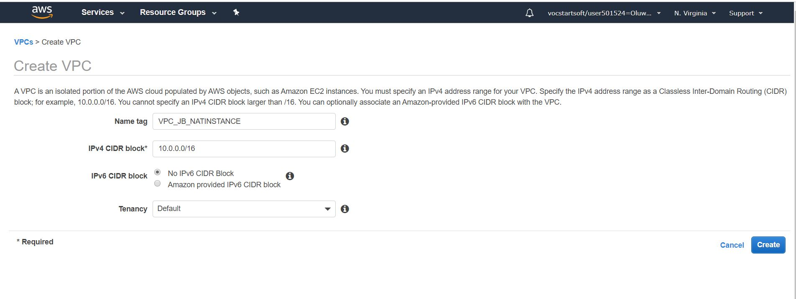
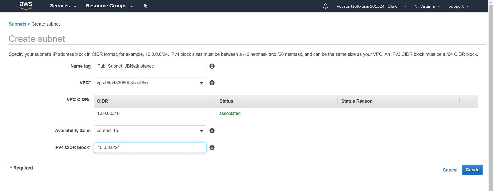

# AWS_NAT_INSTANCE_TUTORIAL
This project shows how to create an AWS NAT Instance and connect to the internet from a private subnet via a Jumb-box linked with the NAT_INSTANCE

## STEP 1
  * Create a VPC and give it an appropriate IP Range e.g 10.0.0.0/16
  
## STEP 2
  * Create Two Subnets 
    * One Public Subnet 
     
    * One Private Subnet
     
