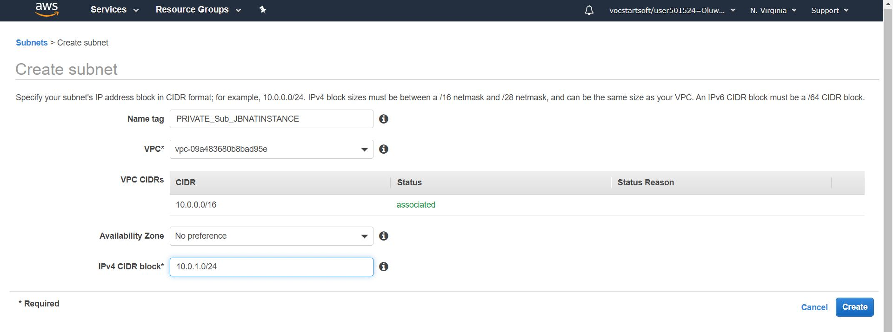
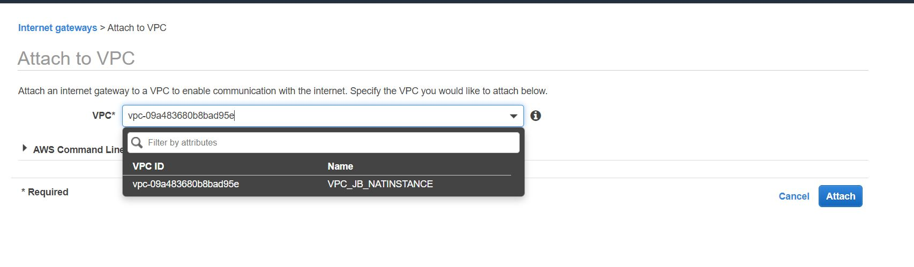

# AWS_NAT_INSTANCE_TUTORIAL
This project shows how to create an AWS NAT Instance and connect to the internet from a private subnet via a Jump-box linked with the NAT_INSTANCE

## STEP 1
  * Create a VPC and give it an appropriate IP Range e.g 10.0.0.0/16
  

## STEP 2
  * Create Two Subnets 
    * One Public Subnet 
     
     
    * One Private Subnet
     
    
## STEP 3 
  * Create an Internet Gateway through which your public subnet will access the internet
     
     * On creation of the Internet Gateway, you will see it detached like this:
      
      
     * Click on Actions and attach your Internet Gateway to the VPC you earlier created
      
     
